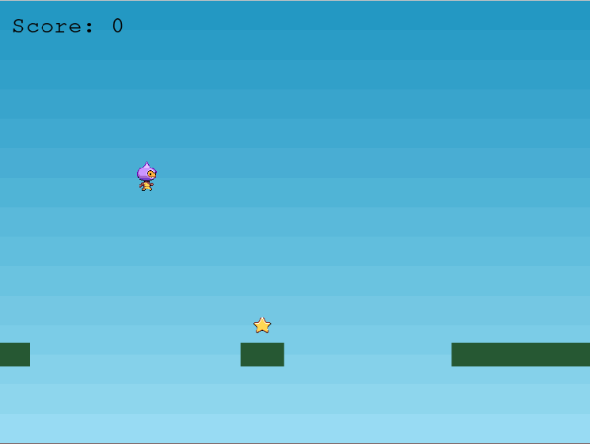

# Endless Runner in Phaser 3.

This game is simple, you are a space monkey that runs and collects stars until it falls from the platforms. The more star you collect the more points you get. Try to get to the top of the leaderboard.

## How to Play.

If it is the first time that you are playing, you are going to get a form on your screen asking you for your name so that the game can use it in the leaderboard.
After entering your name you are going to be presented with the main menu also known as the titleScene.

### Controlling the Character.

To control the character, all you have to use is the Up arrow key to jump.

### Title Scene.

Here you are presented with a menu that has three options 'Play', 'Leaderboard', and 'Credits'. To start the game all you have to do is click on the Play button.

### Game Scene.

When the actual game starts you have to jump from one platform to another at the same time that you try to collect stars. When you lose the CreditsScene is going to start.

### LeaderBoard Scene.

This portion of the game is simple, You are going to be presented with all the players with the top ten scores and a button to return to the main menu.

For the leaderboard, the way that it works is simple, in the form you were presented at the beginning, the name that you entered there is going to be saved using local storage, and then that name along with your score is going to be POSTed on the API. When the leaderboard is displayed the data is gotten from the API.

## Built With

- Java Script
- Phaser 3
- Webpack
- HTML
- Netlify

## Live Demo

[Game Demo Link](https://elated-boyd-63e9ea.netlify.app/)

## Getting Started

- Install the Nodejs: https://nodejs.org/en/download/
- Clone this repo using the following link: https://github.com/balerum03/Platform-game-JS.git
- Go to the directory you just cloned and open your terminal
- Once in the terminal run `npm install`
- Finally start the server with the command `npm start` and go to http://localhost:8080/

👤 **Adan Fernandez Bonilla**

- Github: [@balerum03](https://github.com/balerum03)
- Twitter: [@balerum03](https://twitter.com/balerum03)
- Linkedin: [Adan Fernandez B.](https://www.linkedin.com/in/adan-fernandez-bonilla)

## 🤝 Contributing

Contributions, issues and feature requests are welcome!

Feel free to check the [issues page](issues/).

## Show your support

Give a ⭐️ if you like this project!

## 📝 License

This project is [MIT](lic.url) licensed.
